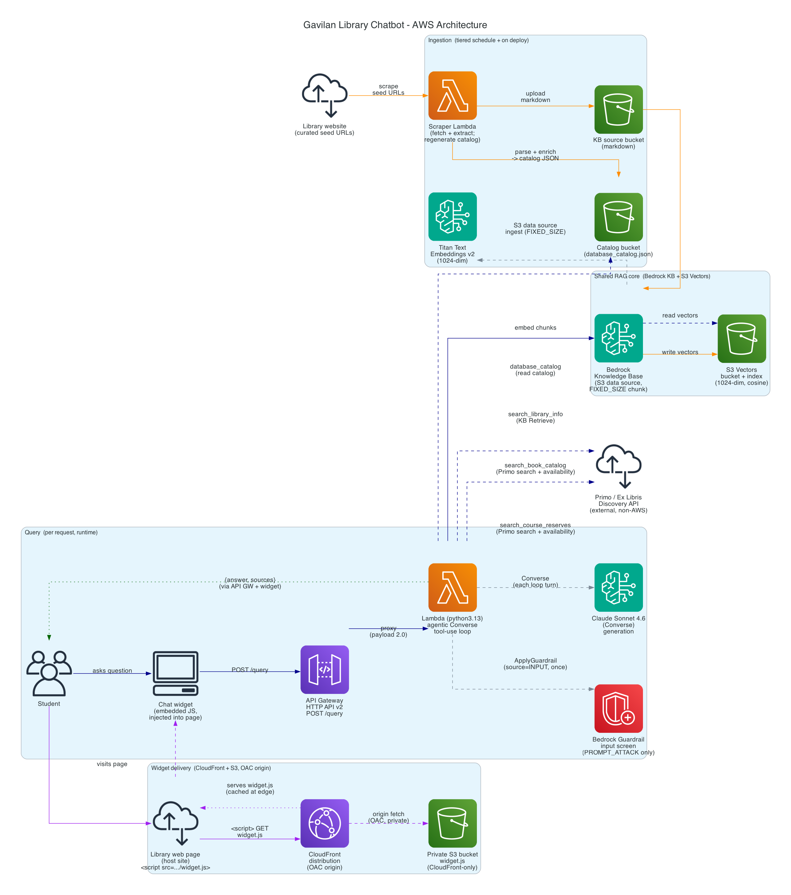

# Gavilan Library Chatbot

## Index

| Section | Purpose |
|---------|---------|
| [Overview](#overview) | What this is and who it is for |
| [Description](#description) | Technology stack and repository structure |
| [Architecture](#architecture) | Diagram and full design write-up |
| [Deployment](#deployment) | Prerequisites and install steps |
| [Configuration Reference](#configuration-reference) | `config.yaml` settings |
| [Usage](#usage) | Embedding the widget, theming, feedback, evals |
| [License](#license) | Project licensing details |
| [Collaboration](#collaboration) | Contact information for the team |
| [Disclaimers](#disclaimers) | Legal and usage disclaimers |

## Overview

After-hours RAG chatbot for Gavilan College Library. It answers common student questions (hours,
checkout, textbooks, what the library offers) when librarians are offline, and points research
questions to a human librarian. Built with Cal Poly DxHub.

It is deliberately not an AI research librarian. The scope is operational questions a student
would otherwise ask at the desk, answered from the library's own website plus the live catalog,
with a human handoff for anything past that.

## Description

**Tech stack overview** (AWS-native):

- **RAG:** Amazon Bedrock Managed Knowledge Base (S3 data source) over an Amazon S3 Vectors store (Titan Embed v2, 1024-dim, semantic search)
- **Generation:** Bedrock-hosted Claude via an agentic Converse tool-use loop
- **Tools:** `search_library_info` (KB retrieval), `database_catalog` (research-database availability + subject lookup), `search_book_catalog` (Primo general catalog), and `search_course_reserves` (Primo course reserves)
- **Live catalog:** `search_book_catalog` + `search_course_reserves` query the Ex Libris Primo discovery API directly - the only external, non-AWS dependency (timed out and soft-failing so a slow or broken Primo never blocks a response)
- **Ingestion:** a scraper Lambda pulls the library site into the KB source bucket and regenerates the database catalog on a tiered schedule - hours pages daily, the full sweep every five days - with every downstream step change-gated
- **Backend:** Lambda + API Gateway HTTP API v2 (Python)
- **Feedback:** `POST /feedback` emails a librarian, via SNS, when someone reports a wrong answer - carrying the pages that answer cited, because fixing the page fixes the bot
- **Infrastructure:** AWS CDK (Python)
- **Guardrails:** one Bedrock Guardrail, screening the input for prompt injection only (no other content filter, no PII policy, nothing on the output)
- **Frontend:** an embeddable, dependency-free JS widget, bilingual (English + Español), themeable at runtime without a redeploy

**Repository structure:**

- `infra/` - CDK app (Knowledge Base, S3 Vectors store, scraper, catalog bucket, Lambdas, API Gateway, IAM)
- `app/` - Lambda backend (agentic tool-use loop + tools, feedback handler, theme handler)
- `scraper/` - the ingestion Lambda and its shared fetch/extract code
- `eval/` - retrieval and answer-quality evaluation harness
- `frontend/` - chat widget, theming pages, and the demo page
- `config.yaml` - model, chunking, retrieval, catalog, feedback, and guardrail settings
- `docs/` - the [install guide](docs/install.md), architecture, and planning

## Architecture



Full design, including the paths the diagram leaves out: [`docs/architecture.md`](docs/architecture.md).

## Deployment

**[`docs/install.md`](docs/install.md) is the install guide**: AWS prerequisites, the one config
value to set first, `cdk deploy`, pasting the embed tag onto your site, and setting up the
librarian's settings page. Read it before you deploy.

**Prerequisites:** AWS credentials, Bedrock model access, Node.js, the CDK CLI (built against
`2.1129.0`), Python 3.13, and a bootstrapped account/region.

**Steps:**

```bash
cd infra
python3 -m venv .venv
source .venv/bin/activate
python -m pip install -r requirements.txt -r requirements-dev.txt

cdk synth      # offline, no credentials needed
python -m pytest   # unit tests (boto3 stubbed, no live AWS)
cdk deploy     # needs AWS credentials + a bootstrapped account
```

`cdk deploy` provisions everything (KB, S3 Vectors store, scraper, catalog bucket, query Lambda,
HTTP API, the guardrail, and the CloudFront-fronted widget) and outputs a paste-ready embed tag,
the CloudFront domain, the `/query` URL, and the settings-editor URL. CloudFront is slow to create
and destroy (~15-30 min each), so the first deploy takes a while. Tear down with `cdk destroy`.

## Configuration Reference

All changeable settings live in `config.yaml` at the repo root; the CDK app reads it at synth. Key
sections:

- **`knowledge_base` / `vector_store` / `data_source` / `chunking`** - embedding model, index
  dimensions and distance metric, and how documents are split
- **`scraper`** - the freshness tiers: each tier's cron and its seed URLs, plus KB exclusions
- **`retrieval` / `generation`** - passages per retrieval, the generation model, token caps
- **`catalog` / `library_links` / `primo`** - the database catalog, the curated canonical URLs, and
  Primo API wiring
- **`http_api` / `cors`** - throttling and the exact-match origin allowlist (a wildcard is rejected
  at synth)
- **`feedback`** - the librarian notification address and the request caps
- **`guardrail`** - the input prompt-injection screen and its blocked-input message
- **`cost_model`** - published rates and measured per-question constants

The eval harness has its own separate config; see [`eval/README.md`](eval/README.md).

## Usage

**Embedding the widget.** The deploy outputs a one-line `<script>` tag. Paste it onto the library
page and the widget mounts itself - no build step, no dependencies, no credentials in the tag.

**Theming.** The highlight colour, the font and the starter questions are read at runtime from a
`theme.json` at the widget bucket root, so a librarian can change them without a redeploy. The
deploy outputs a hosted settings editor for exactly that; see
[`docs/widget-theming.md`](docs/widget-theming.md).

**Reporting a bad answer.** `POST /feedback` emails the librarian the question, the answer, and the
pages that answer cited. There is no server-side store by design - the email is the record. The fix
is usually a webpage edit: correct the page, and the next scheduled scrape of that page's tier
corrects the bot. Set `feedback.notify_email` in `config.yaml` to switch it on.

**Evaluation.** `eval/` holds the retrieval probe, the offline chunking eval, and a promptfoo
answer-quality suite. The offline parts run with no credentials; the rest need a deployed stack and
cost money per run.

## License

MIT. See [LICENSE](LICENSE).

## Collaboration

Thanks for your interest in our solution. Having specific examples of replication and cloning
allows us to continue to grow and scale our work. If you clone or download this repository, kindly
shoot us a quick email to let us know you are interested in this work!

[wwps-cic@amazon.com]

## Disclaimers

Customers are responsible for making their own independent assessment of the information in this document.

This document:

(a) is for informational purposes only,

(b) references AWS product offerings and practices, which are subject to change without notice,

(c) does not create any commitments or assurances from AWS and its affiliates, suppliers or licensors. AWS products or services are provided "as is" without warranties, representations, or conditions of any kind, whether express or implied. The responsibilities and liabilities of AWS to its customers are controlled by AWS agreements, and this document is not part of, nor does it modify, any agreement between AWS and its customers, and

(d) is not to be considered a recommendation or viewpoint of AWS.

Additionally, you are solely responsible for testing, security and optimizing all code and assets on GitHub repo, and all such code and assets should be considered:

(a) as-is and without warranties or representations of any kind,

(b) not suitable for production environments, or on production or other critical data, and

(c) to include shortcuts in order to support rapid prototyping such as, but not limited to, relaxed authentication and authorization and a lack of strict adherence to security best practices.

All work produced is open source. More information can be found in the GitHub repo.
